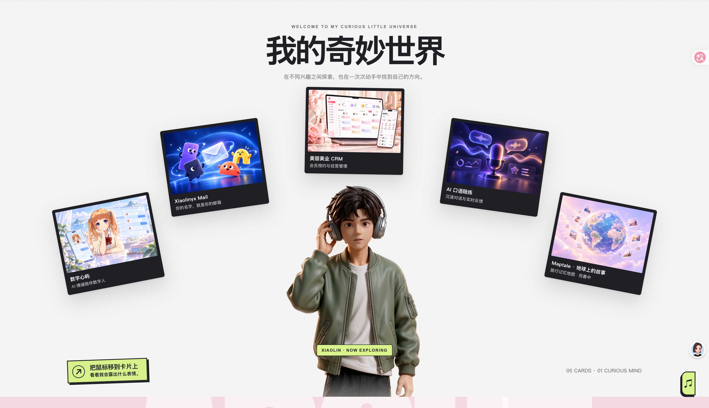
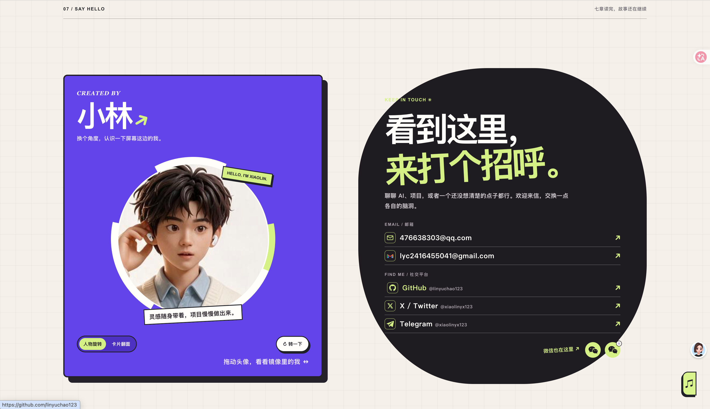

<b>你好，我是小林（xiaolin）。</b> 软件工程专业在读，把「要不试试」写成真正能用的作品。

  <a href="https://xiaolinyx.me/"><b>走进我的个人网站 ↗</b></a> ·
  <a href="#为什么加入-pieces-lab">为什么加入</a> ·
  <a href="#关于我">关于我</a> ·
  <a href="#个人网站--xiaolin-os">个人网站</a> ·
  <a href="#项目陈列室">项目陈列室</a> ·
  <a href="#联系我">联系我</a>

  <a href="https://xiaolinyx.me/">个人网站</a> ·
  <a href="https://github.com/linyuchao123">GitHub</a> ·
  <a href="mailto:476638303@qq.com">邮箱</a>

## 为什么加入 Pieces Lab

我加入 Pieces Lab，想让自己的项目被更多喜欢创作的人看到，也想认识愿意认真讨论产品、设计和代码的朋友。一个作品从想法走到可用版本，总会遇到取舍和返工；我愿意把成果与过程都分享出来，和社区一起交流这些真实经验。

## 我的初心

最初吸引我动手的，是一个个「能不能把它做出来」的问题。学到新技术时，我更想找个具体场景试一试：数字人能否把对话变得自然，英语练习能否给出有用的反馈，记账和备考工具能否真的融入每天的生活。

我喜欢从一个小版本开始，边做边发现哪里不够好，再继续改。AI 让尝试变得更快，但理解需求、打磨体验和验证结果仍要自己完成。我希望保持这份好奇，也把工程基本功练扎实，做出有人愿意继续使用的作品。

## 关于我

我是软件工程专业在读本科生，关注 AI 应用如何进入真实的软件流程。现在主要用 Python 和 TypeScript 做项目，涉及对话智能体、多模态交互、Web 应用与个人效率工具，也持续学习后端开发和软件测试。

在 [Xiaolin OS](https://xiaolinyx.me/) 上，我把个人介绍、项目案例和学习中的想法整理成一个可以探索的空间。这个仓库则是作品索引：你可以从下面进入各个项目，查看源码、使用方式和最新进展。

## 个人网站 · Xiaolin OS

这是一个用设计和代码写成的个人空间。首页以人物和大幅文字开场，继续向下可以进入兴趣卡片、项目案例、工具箱和关于我的页面；桌面与手机都有对应布局。

**[在线访问 ↗](https://xiaolinyx.me/)** · [项目介绍](projects/xiaolin-os.md) · [网站源码](https://github.com/linyuchao123/xiaolin-os)

## 项目陈列室

这些项目从陪伴、学习到日常工具，记录了我把不同想法一步步做出来的尝试。

| 项目 | 在做什么 | 方向 |
| --- | --- | --- |
| [数字心屿](https://github.com/linyuchao123/digital-human-companion) · [在线体验 ↗](https://xiaolinyx.cloud/) · [介绍](projects/digital-human-companion.md) | 结合数字人、文字与语音对话、心理学知识检索和用户可控的长期记忆。 | AI 数字人 |
| [AI 英语口语陪练](https://github.com/linyuchao123/AI-Spoken-English-Trainer) · [介绍](projects/ai-spoken-english-trainer.md) | 围绕面试、点餐、会议场景练习口语，提供发音评测、语法纠错与课后报告。 | AI 英语学习 |
| [Xiaolinyx Mail](https://github.com/linyuchao123/xiaolinyx-mail) · [在线体验 ↗](https://mail.xiaolinyx.me/) | 基于开源 Cloud Mail 与 Cloudflare 建立个人域名邮箱服务，支持收发邮件与多端使用。 | 邮箱服务 |
| [Maptale](https://github.com/linyuchao123/Maptale) | 探索在地图上记录和分享故事。 | 地图叙事 |
| [消费有迹 · iPhone 记账平台](https://github.com/linyuchao123/iphone-spending-dashboard) | 面向 iPhone 的消费记录与统计面板，支持账单导入、离线记录和跨设备同步。 | 个人记账 |
| [六级词伴 · English CET-6](https://github.com/linyuchao123/English-CET-6) | 按高频词学习、掌握检测和薄弱词复习组织六级词汇练习。 | 英语学习 |
| [研途 · Kaoyan Agent Workbench](https://github.com/linyuchao123/Kaoyan-Agent-Workbench) | 将学习计划、专注计时、错题复习、私有资料检索与学习助手放进同一工作台。 | AI 学习工具 |

**[查看我的更多仓库 ↗](https://github.com/linyuchao123?tab=repositories)**

## 学习与记录

我希望留下的不只是成品，也包括项目怎样被设计、验证和继续改进。想了解过程，可以从 [Xiaolin OS 的制作记录](https://github.com/linyuchao123/xiaolin-os/tree/main/docs)、[数字心屿的系统完成度审计](https://github.com/linyuchao123/digital-human-companion/blob/main/docs/system-completion-audit-2026-09-22.md)和[研途的架构文档](https://github.com/linyuchao123/Kaoyan-Agent-Workbench/blob/main/docs/architecture.md)开始。

我的实践顺序通常是：**找到真实场景 → 做出能用的版本 → 检查边界与体验 → 继续迭代**。

## 技术与工具

<code>Python</code> <code>TypeScript</code> <code>FastAPI</code> <code>React</code> <code>Astro</code> <code>LangGraph</code> <code>RAG</code> <code>Cloudflare</code> <code>Git</code>

以上是当前项目中使用或正在学习的工具，具体技术栈以各项目仓库为准。

## 联系我

- 个人网站：[xiaolinyx.me](https://xiaolinyx.me/)
- GitHub：[@linyuchao123](https://github.com/linyuchao123)
- QQ 邮箱：[476638303@qq.com](mailto:476638303@qq.com)
- Gmail：[lyc2416455041@gmail.com](mailto:lyc2416455041@gmail.com)
- X / Twitter：[@xiaolinyx123](https://x.com/xiaolinyx123)
- Telegram：[@xiaolinyx123](https://t.me/xiaolinyx123)
- 微信：[个人微信二维码](https://xiaolinyx.me/contact/wechat-personal.jpeg) · [微信公众号二维码](https://xiaolinyx.me/contact/wechat-channel.jpeg)
- 社区：[Pieces Lab](https://github.com/Pieces-lab)

<b>关于这个作品集仓库</b>

这是我在 Pieces Lab 的个人展示空间。网站程序、项目代码与最新功能以对应仓库为准；海报与网站截图的素材说明见 [ATTRIBUTION.md](ATTRIBUTION.md)。

---

<b>让想法长成作品，让作品继续生长。</b> XIAOLIN / A PERSONAL COLLECTION · PIECES LAB

